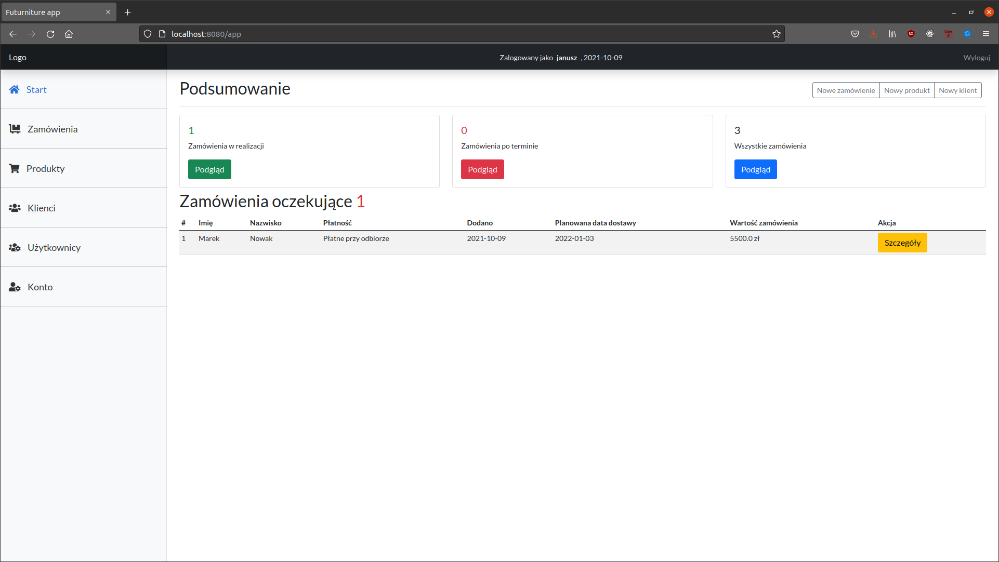
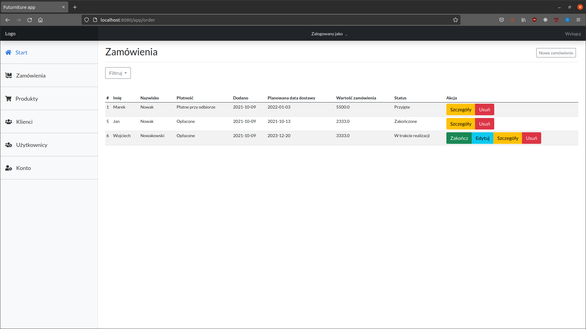
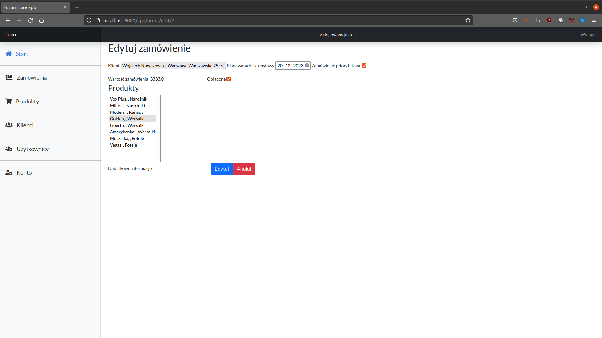
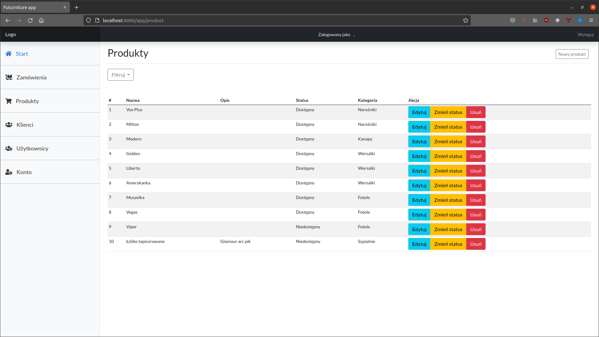

# Futurniture
A simple application for order processing in a small company. The application allows adding and managing products, categories, customers, users along with validation of the entered data. The application is currently under constant development. I am not a frontend devoloper so the application is not very beautiful. 
## Used technologies: 
* Java
* Spring boot
* Spring MVC
* MySql
* Hibernate
* Jsp
* Bootstrap

## Example screenshots of the application:

### Main page
 

### Order list
 

### Order edit

### Product list
 
